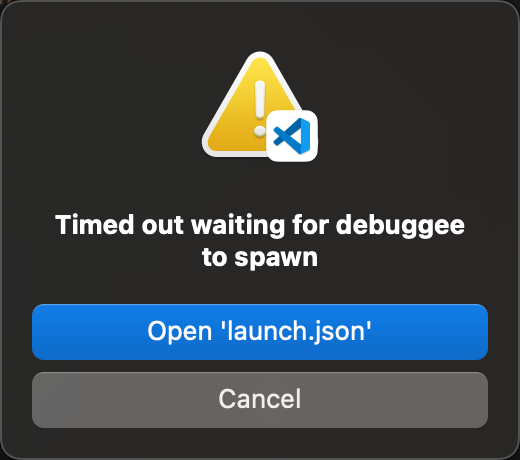

### 问题描述

最近 debug 一个 huggingface-based 项目时，使用 vscode 远程连接服务机，python 扩展做断点调试。vscode (debugpy) 报错如下：

{: style="display: block; margin: auto; width: 200px"}

表现为待调试程序在调试启动后几秒内退出，没有任何其他症状。

### 问题起因

不 debugpy 断点调试的情况下，程序在开始运行时会等待数秒，阻塞地尝试连接 huggingface 服务器。项目本地已经预存有程序需要的缓存，因此即使连接不成功对程序运行成功与否也没有影响。如果设置环境变量使程序能够成功连接，则该阻塞用时缩短至不超过 1 秒。

由于 vscode debugpy 默认的 timeout 时限为 6 秒，一旦程序在开始运行时等待时间过长，则会使 debug 连接超时，debugee 原地去世。这是可以预期的功能而非需要改正的错误。

### 解决方案

- 使程序开始运行时能够迅速连接到 huggingface 服务器，从源头避免超时。例如，在 vscode 起调试进程的 console 当中设置环境变量，可以使程序连接至镜像站：
  ```sh
  export HF_ENDPOINT=https://hf-mirror.com
  ```
- 更改 vscode debugpy 的超时时间，使调试进程能够等待更久。
  ```sh
  # .profile
  export DEBUGPY_PROCESS_SPAWN_TIMEOUT=1200
  ```
  例如，修改该环境变量的值，使超时时间变为 1200 秒。
  需要注意的是，修改 `.profile` 理论上影响的是 vscode server 起始进程，这个进程运行在整个 vscode server 树唯一的 login shell 中。一旦远程连接了 vscode server，再起调试进程产生的 console 末端是 (interactive) non-login shell，理论上是不读取 `.profile` 的。幸好这个 shell 起来的时候读取 `.*shrc`，因此为了保险起见，也可以同时将这个环境变量写入 `.bashrc` 或其他 rc 当中。
  而且，这一解决方案并不能即时生效。经过实测，即使在 `.profile` `.bashrc` `.zshrc` 中均写入这一环境变量值 ~~（有种结膜炎开了细菌药病毒药过敏药总有一种会好使的美）~~，并手动结束所有 vscode server 进程，立即重新连接，debugpy 超时时间仍为默认的 6 秒。需等待一段时间后才能生效，推测为某种奇怪的磁盘缓存，或者 host 机器本身就有毛病。类似地，取消设置该环境变量，debugpy 也无法立即恢复为默认的超时时间，如果在待调试程序还没起来就手动结束，debugpy 仍然会耐心地等到 1200 秒后才报告超时。